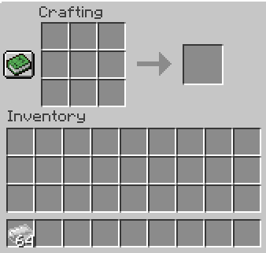
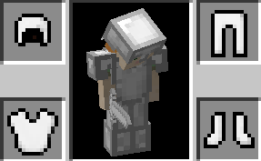
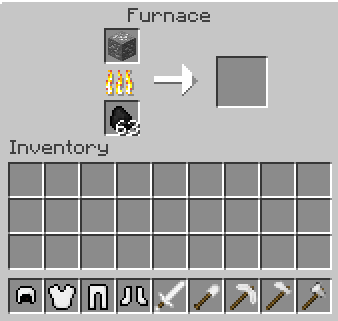

# Minecraft Mod

I made a minecraft mod written in Java. This was my first Java project and I used this project as a way to learn the syntax of Java and learn how to structure code in Java. 

## Overview
The main part of the mod is the material nickel. Nickel was made to be stronger than stone but a bit weaker than iron. This mod runs on the Minecraft version of 1.12.2. I used Forge to build my mod. the ModID is "sm". The ModID differentiates mods so the mod won't conflict with other mods that are installed with Forge.

## Crafting Materials
Crafting works just as it would with other mateirals like gold and iron. Filling a crafting table with nickel nuggets makes one nickel ingot. Placing one nickel ingot in a crafting table gives nine nickel nuggets. A user can craft nine nickel ingots into one nickel block and can craft one nickel block into nine nickel ingots.

## Ore
There is ore generation in this mod. The nickel ore spawns between the y levels of 16 and 64.

## Tools
The nickel tools includes: Nickel Sword, Nickel Shovel, Nickel Axe, Nickel Hoe, and the Nickel Pickaxe. Each are stronger and more durable than stone tools but are weaker and have less durability than iron tools.

## Armor
The nickel armor includes: Nickel Helmet, Nickel Chestplate, Nickel Leggings, and the Nickel Boots. This durability and protection is the same story with the tools: a bit weaker than iron but stronger than chainmail armor because there is no stone armor.

## Smelting
A user can smelt any piece of nickel armor or any nickel tool for one nickel nugget. In reality, a user would do this if their armor or tool is almost broken.

## Download
A user can download Forge [here](http://files.minecraftforge.net/).
